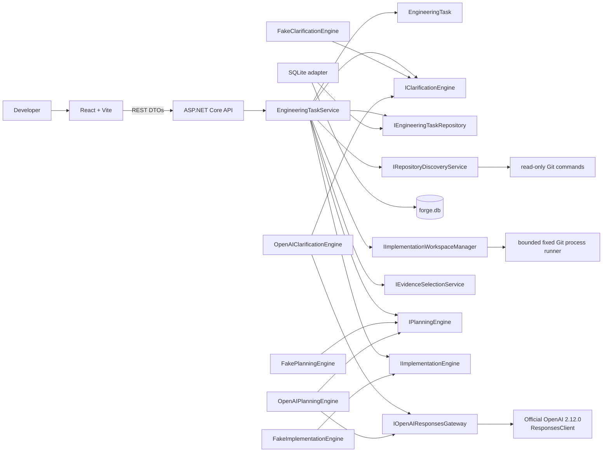
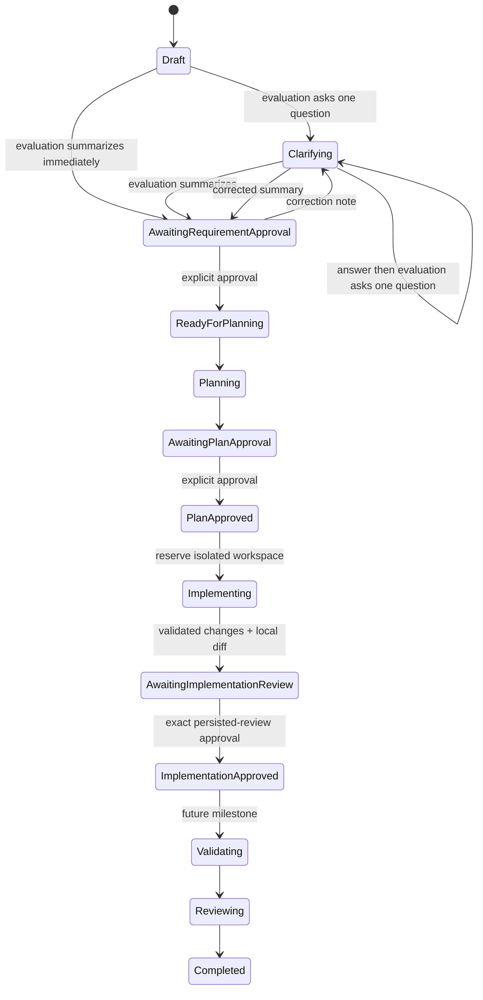
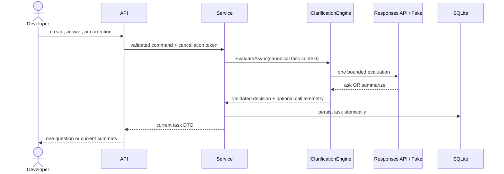

# Architecture

## Components and dependency direction

- **Forge.Core** owns the aggregate, approval gates, repository/evidence/plan contracts, workflow invariants, and application service. It has no project dependencies.
- **Forge.Infrastructure** implements SQLite, clarification/planning/implementation adapters, safe repository discovery, and isolated Git worktree mutation.
- **Forge.Api** composes modes and workflow services, exposes REST DTOs and safe capabilities, and maps exceptions to Problem Details.
- **forge-web** renders clarification, evidence, plans, approvals, bounded implementation diffs, capabilities, and telemetry through REST.

Dependencies point inward: API and Infrastructure depend on Core; Core knows neither. Official SDK types remain inside `SdkOpenAIResponsesGateway`. The `IOpenAIResponsesGateway` normalization boundary permits non-billable adapter tests.

## Clarification state and correction flow

The aggregate has no public general-purpose state transition. Application callers use explicit operations to apply an evaluation, answer the current question, request a summary revision, record a model call, or approve a summary.

Correction is permitted only while awaiting requirement approval. The correction record retains its timestamp and previous summary; previous clarification answers remain unchanged. The current summary is cleared before reevaluation and the revised summary requires another explicit approval.

## Read-only repository analysis and planning

After requirement approval, purpose-specific aggregate operations begin analysis, store a compact snapshot, store bounded evidence, store a validated plan, and approve that plan. Re-analysis is allowed before plan approval and replaces the prior snapshot/evidence/plan. Planning rejects missing evidence, stale snapshots, fingerprint mismatches, unsafe paths, unknown evidence IDs, and invalid create/modify/delete targets.

Discovery normalizes the root, contains every inspected path, skips reparse points, and uses `ProcessStartInfo.ArgumentList` for read-only Git commands. It never invokes repository scripts. Common dependency/build folders, generated/minified/binary files, and likely secret files are excluded. Configurable defaults cap discovery at 5,000 files, text at 256 KB per file and 20 MB total, and evidence at 12 files/60,000 characters. Limit warnings make partial inspection visible.

Evidence selection deterministically scores strong phrases, paths, lightweight C#/TypeScript symbols, content, roles, related tests/contracts, and module diversity. Generic documentation and unrelated clarification code receive penalties. Excerpts retain line numbers, are de-duplicated, hashed, and redact obvious sensitive key/value lines before persistence. Redaction is not a comprehensive secret scanner.

`FakePlanningEngine` creates a labelled plan without a model call. `OpenAIPlanningEngine` makes exactly one Responses request using `gpt-5.6-sol`, medium reasoning, a 6,000-token allowance, and strict schema. Plans are capped at ten affected files, eight steps, and eight validation commands, plus four risks, assumptions, and unresolved questions. Both planners produce structured affected files, sequential steps, and up to twelve compact requirement-coverage mappings. Existing paths must cite evidence from that path, creates must be absent from the snapshot, validation commands remain proposals, and absolute/traversal paths are rejected. Evidence selection and mutation scope are deliberately separate: unrelated evidence may remain read-only context, while narrowly recognized approved or latest-correction `only` lists constrain the affected paths. Explicit exclusions, exact action counts, test prohibitions, and validation-command prohibitions are represented deterministically. A Core trust gate checks every Fake or OpenAI candidate against those constraints before persistence, and a structurally requested revision that changes only wording fails safely. Plan approval moves the workflow to `PlanApproved` and is the only initial implementation gate.

## Isolated implementation boundary

`IImplementationEngine` returns bounded structured create/modify/delete operations, never commands or patches. Before any lease, task state transition, ownership ref, branch, or worktree, read-only inspection returns exact bounded mutating-file contexts. The configured Fake or OpenAI engine generates one logical proposal, and the domain validator checks exact one-to-one coverage, actions, original hashes and UTF-8 byte counts, source identities, undeclared/duplicate paths, create/modify/delete content, no-op rules, sensitive content, and per-file/total limits. That validated output is reused rather than regenerated. Inspect-only plan paths may be materialized as read-only context but are never sent as implementation operations.

`IImplementationWorkspaceManager` revalidates a clean exact Git root and approved HEAD, captures active HEAD/branch/index/status plus bounded hashes of all tracked regular working-tree bytes, then byte-for-byte compares paths, actions, source hashes, and source content with the preflight both before owned Git artifacts and after sparse materialization. It creates a deterministic task branch and linked sparse worktree outside the repository, disables hooks/submodules/fsmonitor/external diff/LFS smudge, rejects executable filters, symlinks/gitlinks/reparse points, malformed/truncated/abnormal/sparse index states, and materializes only approved paths. All source content dependencies and filesystem targets are contained, size-bounded, and secret-scanned before reservation or the first atomic write. Local fixed-argument Git diff supplies complete hashes/counts and bounded previews with explicit truncation; result/operation free text, safe failures, source/generated content, and diffs share the high-confidence detector with credential-labelled entropy detection. No repository command, build, test, lint, stage, commit, push, or provider request occurs.

Workspace identity is persisted without exposing its absolute path through DTOs. Core supplies one stable `Repository <16 hex>` identifier used by API history/detail and Fake clarification, preventing indirect path disclosure through task and plan PDFs. A reserved untouched workspace may be reconstructed and resumed after restart. Completed results include a deterministic manifest fingerprint binding every per-file review field, preview hash, result total, completion/certainty field, and actual final-file hash/line/byte and worktree totals. It is verified under the operating-system lock immediately before and after persistence and during later availability checks. A missing, changed, or metadata-inconsistent workspace leaves the historical bounded diff readable but changes runtime disposition to `RecoveryRequired`; it is never automatically reset or deleted. Concurrent implementation commands are serialized in-process and protected across processes by row-version compare-and-swap updates, a fixed-duration persisted owner/attempt lease, and an exclusive operating-system workspace lock. An exhaustive status/phase/lease/failure/timestamp matrix governs every durable projection and preserves an explicit legacy path. One SQLite statement returns implementation JSON and its character/blob-byte lengths from one snapshot, validates all lengths before `GetString`, and never writes during GET; provider failures are normalized without exposing storage details.

Successful generation also creates authoritative implementation revision 1. Its canonical review fingerprint binds the task/revision identity, complete approved-plan fingerprint, base and branch, source/model, ordered changed-file review and preview hashes, aggregate diff data, completion timestamp, checkout certainty, and physical-result metadata. Exact approval requires the current row version, revision ID, review fingerprint, and `ActiveCheckoutVerified == true`, then transitions only `AwaitingImplementationReview` to terminal `ImplementationApproved`. A dedicated approval controller and service depend only on the operation coordinator, clock, and atomic approval repository; their graph cannot resolve Git/worktree/runtime services. SQLite globally binds each approval command ID to task, original row version, revision, and fingerprint, and commits the binding, task CAS, resulting row version, and immutable timestamp in one immediate transaction. Exact replay verifies that immutable state without another save. Approval therefore performs no Git, filesystem, workspace, lock, recovery, or runtime-observer operation and does not certify current physical availability. Legacy completed reviews synthesize the same deterministic initial revision identity on every read and are never inferred to be approved. The existing top-level implementation fields remain a transitional compatibility projection and must match the authoritative revision exactly on every save and read. API and PDF branch projections share one formatter that omits the private workspace token while retaining the real branch only in domain and persistence state.

All Git invocations share a startup-resolved absolute executable and one hardened execution envelope. Runner construction performs only in-memory path normalization and containment validation; dependency resolution and read-only HTTP routes create no worktree-root, hooks, or Git-home directories. The owned directories are created, checked for reparse points and containment, and verified empty only at the beginning of an operational Git command. The child environment is rebuilt from a small allowlist; Git directory/worktree/index/object/config/attribute overrides are not inherited; prompts, credentials, pagers, external diff, textconv, fsmonitor, hooks, submodule recursion, optional locks, LFS smudging, and automatic maintenance are disabled or contained. Correctness-bearing truncated output is rejected rather than interpreted as complete.

Writable files are currently limited to strict UTF-8 without a BOM. Snapshot metadata carries BOM/strict-UTF-8 eligibility and plan validation rejects an ineligible mutating path before approval. This slice does not claim general encoding preservation.

## OpenAI structured-output boundaries

Clarification uses `gpt-5.6-terra`, low reasoning effort, and a bounded 800-token output. Planning uses `gpt-5.6-sol`, medium reasoning effort, and a bounded 6,000-token allowance covering visible and reasoning tokens. Both use the Responses API with `ResponseTextFormat.CreateJsonSchemaFormat(..., jsonSchemaIsStrict: true)`. The clarification schema contains:

- `decision`: `ask` or `summarize`;
- nullable `question`, internal `questionFocus`, and `summary`;
- arrays for known facts, assumptions, and unresolved gaps.

After deserialization the adapter independently enforces:

- ask: one concise question for one atomic decision dimension, one snake-case focus, and no summary;
- summarize: one non-empty summary and null question/focus.

Questions with multiple marks, newlines, list syntax, excessive length, or a structurally combined focus are invalid provider responses. Semantic atomicity remains primarily prompt- and focus-driven. Forge never repairs output, makes a second model call, free-form parses, or silently invokes Fake mode.

The planning schema requires title, objective, repository understanding, affected files, ordered structured steps, proposed validation commands, risks, assumptions, unresolved questions, requirement coverage, and summary. Coverage items map concise material requirements to declared affected paths and existing step orders; local validation checks those references without claiming semantic completeness. Planning instructions distinguish implementing tests from merely executing validation commands, require a concrete artifact generator and endpoint integration for generated exports, and direct the planner toward evidence-backed API helpers, service boundaries, dependency registration, project/package files, and test projects. Supported `maxItems` constraints reinforce collection caps, which are independently enforced after deserialization. Source, model, timestamp, and repository fingerprint are enriched internally. Canonical context contains requirement context, the bounded derived explicit-constraint representation, repository totals/stack/project/test metadata, warnings, and selected evidence only; it excludes the normalized root, the complete repository file list, full file contents, raw responses, credentials, and hidden reasoning. The latest correction replaces an earlier authoritative allowlist only when it supplies a new explicit list; otherwise its explicit exclusions and policy restrictions narrow the approved constraints.

The normalized gateway preserves `ResponseResult.Status` and `IncompleteStatusDetails.Reason`. Planning deserializes only `Completed` output. `Incomplete` with `MaxOutputTokens` becomes `output_truncated`; `ContentFilter` becomes `content_filter`. Both preserve response ID, usage, and estimated cost while discarding partial text. There is no automatic retry; the UI offers an explicit one-call retry using the persisted fresh snapshot and evidence, and switches to explicit re-analysis only when the API reports a stale snapshot.

The developer instruction prefix is stable. Each turn reconstructs one compact JSON context containing only the repository identifier, original requirement, previous question/answer pairs, and correction notes. Repository content is never implied. `previous_response_id` is intentionally unused.

### OpenAI implementation boundary

OpenAI implementation uses the same singleton normalized Responses gateway as clarification and planning, with a separate `OpenAIImplementationEngine`. Read-only Git inspection finishes before transport and creates no Forge-owned directory or Git artifact. A canonical context fingerprint binds the approved requirement, complete plan fingerprint, approved base SHA, every complete source body/hash/UTF-8 byte count and per-operation identity, directly cited evidence, complete included convention notes, and the deterministic omission count.

The strict root schema requires `contextFingerprint`, `summary`, `warnings`, `creates`, `modifies`, and `deletes`; action-dependent fields are required only within their containing array and no provider command or patch field exists. The normalized response must be completed and contain exactly one assistant message with exactly one `output_text`; opaque reasoning items are ignored, while refusals, tools, unknown items, extra messages, or extra text parts fail closed. The engine caps raw structured output at 128 KiB, generated content at 32 KiB per file and 64 KiB total, and operations at ten. Core then independently verifies exact approved coverage, action, path, original hash/size, context identity, absence/presence, no-op, file class, content, and sensitive-value rules before any workspace reservation.

At most two physical requests belong to one logical attempt. Transport failures carry explicit dispatch certainty: `DefinitelyBeforeRequestDispatch`, `DispatchMayHaveOccurred`, or `ResponseReceived`. Only explicit 429, 502, 503 responses and failures proven definitely before dispatch can retry. Unknown `HttpRequestException`, resets, interrupted response bodies, stream failures, timeouts, and cancellations do not retry; duplicate-billing avoidance takes priority over availability. Each physical request receives a fresh client request ID and produces its own persisted model-call record. Usage is available only when required input/output counters are valid bounded nonnegative integers; optional cached/reasoning counters remain null when absent. Pre-transport failures record no call. A provider or proposal failure leaves the task `PlanApproved` with no branch, ref, worktree, lease, revision, or review.

Clarification, planning, and implementation share one response-topology validator. It requires completed status, a bounded safe provider response ID, zero or more ignored reasoning items, exactly one assistant message and output-text item, and no refusal, tool, second message/text, or unknown item. Each stage then performs its own strict JSON/domain validation. A recursive ordinal `Utf8JsonReader` pass rejects duplicate properties before deserialization. Pricing, implementation output-token bounds, timeout, and reasoning effort are validated before provider use; post-dispatch cost arithmetic is fail-soft so telemetry survives with unavailable cost.

## Telemetry and estimated cost

Each real provider attempt records call ID, clarification, planning, or implementation stage, provider, model, reasoning effort, timestamps, success, safe provider request/response IDs when available, nullable input/cached/output/reasoning tokens, estimated cost, stored pricing, and a non-sensitive failure category. Failed planning and dispatched implementation attempts are persisted before their safe error is returned. Fake mode produces no model-call record.

Verification usage has one authoritative `Complete`, `Partial`, or `Unavailable` contract shared by ingestion, persistence validation, and cost projection. `Complete` requires valid input, cached-input, output, and reasoning counters; `Partial` preserves any independently trustworthy subset, including cached-only usage; `Unavailable` means that none is trustworthy. Cached input cannot exceed input and reasoning cannot exceed output. A valid provider-reported zero is preserved as zero and remains distinct from unavailable usage.

`ModelCostResolver` is the shared cost policy used by the verification engine, API projection, frontend contract, and PDF export. Complete usage is priced normally. Partial usage is conservatively costed only when total input and output are known and cached input is absent, by treating all input as uncached; cached-only and other insufficient combinations remain unpriced. It exposes separate complete, partial-conservative, and combined-available subtotals without double counting, plus unavailable and possibly-dispatched-unavailable counts. Readable legacy records are not rewritten, and a partial available subtotal is never a complete task estimate.

The estimate subtracts cached tokens from total input, prices uncached and cached input separately, then adds output pricing. Output already contains reasoning tokens, so reasoning usage is not double-counted. Rates are bound from `Forge:AI:Pricing`.

## Persistence compatibility

`EngineeringTasks` retains the first-slice columns and adds:

- `RequirementRevisionNotes TEXT NOT NULL DEFAULT '[]'`
- `ModelCalls TEXT NOT NULL DEFAULT '[]'`
- bounded snapshot, evidence, and implementation-plan JSON columns;
- bounded implementation workspace, result, safe failure, and lease JSON columns plus start/completion timestamps and an optimistic row version;
- evidence counters, repository analysis/fingerprint fields, and plan creation/approval timestamps.

Development startup uses `PRAGMA table_info(EngineeringTasks)` and adds only missing known columns. Existing databases do not need to be deleted.

## Failure handling and capabilities

Task-report PDF export is a workflow-stage-aware, read-only audit projection. It uses persisted snapshots, selected-evidence metadata without excerpts, explicit revision outcomes, complete persisted plans, implementation-attempt/failure state, and persisted bounded implementation-review diffs; it never reopens approved source or changed-file content. The controller supplies a separately named report-runtime projection that performs only bounded, non-mutating metadata inspection. It rejects absent, colliding, reparse, or malformed worktree paths and requires persisted repository identities plus a valid linked-worktree `.git`/backlink/common-directory/HEAD shape before reporting that non-reparse worktree metadata was observed. It never creates Git safety directories or uses the lock-taking/Git-verifying operational availability path. Persisted completion-time active-checkout evidence is labelled separately and is never described as export-time verification. Legacy completion metadata without its supporting worktree fingerprint is rendered `not recorded`. Historical approved requirement summaries remain unchanged and are contextualised as summary-generation-time records. Proposed plan commands are labelled `NOT EXECUTED` and never treated as validation evidence. A bounded path-aware scanner covers known identities, workspace-token-bearing branches, quoted/unquoted Windows, parenthesized Windows, UNC, slash-UNC, JSON-escaped Windows, recognized local Unix roots, and mixed separators while preserving URLs, relative paths, ordinary slash content, diff syntax, and hashes. Model-cost aggregation processes only the rendered call budget with checked arithmetic. Aggregate character, line, page, per-field, and per-collection limits reserve and account for one deterministic final truncation notice, and heading groups preflight the actual following element.

An MVC exception filter handles only `EngineeringTaskNotFoundException` before it reaches `ExceptionHandlerMiddleware`, returning the established 404 Problem Details contract with trace ID and an Information-level event without a stack. The central handler retains a safe fallback for that typed exception and continues to log genuine unexpected failures at Error. Generic `KeyNotFoundException` is not mapped to a user-facing 404, so unrelated dictionary defects remain visible as server failures. Provider exception bodies and logs never include credentials or raw responses.

`GET /api/system/capabilities` reports clarification, planning, and implementation readiness independently, including the active implementation provider/model/effort and explicit Fake/OpenAI availability. Validation, correction, commit, push, silent fallback, and pull-request creation remain false. No capability exposes a key, prompt, context identity, absolute workspace, or secret-derived data.

## Manual verification Slice A

Core owns `VerificationPlanning`, `AwaitingManualVerification`, `ManualVerificationFailed`, and `ReadyForDelivery`, plus versioned context/plan/attempt fingerprints. `IVerificationPlanEngine` has deterministic Fake and strict-schema OpenAI implementations; neither receives execution authority or invokes Git/workspace services. SQLite stores plans, generation commands, attempts, case-result revisions, and repository-wide command bindings in normalized additive tables. Every mutation uses an immediate transaction, row-version CAS, exact revision/plan bindings, and one immutable child insertion before atomically updating task pointers and state. INSERT guards require a current-format parent, and `BEFORE UPDATE OF TaskId` guards make every verification child and binding permanently owned by its original task.

Plan and result text is untrusted. Local validators enforce character and UTF-8 budgets, approved command references, path containment, secret rejection, completion gates, and append-only history. The API exposes bound generation/start/update/complete commands and read-only verification-plan PDF export. `ReadyForDelivery` records an explicit user-reported pass only; automated validation, failure analysis/correction, and delivery remain unavailable.

Verification-provider generation durably records `Prepared`, `DispatchMayHaveStarted`, `ResponseReceived`, and terminal certainty phases. Dispatch intent increments a logical-attempt count; it is not proof of a physical request. Proven pre-dispatch failures contribute zero physical requests, ambiguous outcomes are counted separately as possibly dispatched, and successful or explicit HTTP responses contribute definite physical requests. The exact UTC logical-call start is captured before dispatch and retained with the call record. The `ResponseReceived` transition atomically stores that start, receive time, bounded normalized response/request identity, status, HTTP status, dispatch certainty, explicit `Complete`/`Partial`/`Unavailable` usage, and every independently valid nullable counter in one SQLite transaction before parsing or cost estimation. Raw provider output is never persisted there, and absent or malformed fields never become zero. A partial response is costed only when input and output are both known; missing cached usage is conservatively priced as uncached input, and the result remains labelled partial.

Free verification prose is classified in stages: bounded traversal decoding and absolute-local rejection precede HTTP/HTTPS URL, RFC 6901 pointer, MIME, approved-path, and credible repository-path recognition. Valid absolute HTTP/HTTPS URLs are neutral references. A relative query- or fragment-bearing token with a credible source/config/document extension, recognized repository root filename, or filename-like path is a repository claim by default; this decision does not depend on an allowlist of nearby verbs. Only bounded explicit URL, route, hyperlink, documentation-link, relative-link, reference, or example language makes it neutral. Traversal in a query or fragment is rejected before classification, including bounded repeated decoding. Approved exact base paths remain allowed.

Verification provider responses carry a domain-separated versioned fingerprint binding the parent verification format, generation command, logical call, UTC start/receive times, request/response identities, dispatch and provider status, HTTP status, usage classification, and token counters. Version zero is positively established only when there are no verification child rows, pointers, workflow states, verification model calls, or command bindings. The additive parent scalar is set to current version 2 in the same transaction and before the first child or binding insert; database guards and monotonic saves prevent normal writes from leaving a child under version zero or decreasing the version. Any artifact requires current parent and child fields, so nested deletion, mixed records, and coordinated parent-plus-child marker downgrade are corruption. Genuine pre-slice tasks with no artifacts are never repaired during GET, history, DTO, capability, or PDF reads. This is bounded tamper detection inside Forge's persistence trust boundary, not a claim against an administrator able to rewrite the database and application. Complete and Partial usage both set the compatibility boolean true; Unavailable sets it false. One bounded persisted-JSON boundary translates malformed, wrong-type, overflow, truncated, oversized, and null-element data to the safe corruption contract before projection while leaving SQLite operational failures distinct.

The browser treats API JSON as untrusted. A compact history decoder is separate from the full task decoder; every full task and mutation response validates all rendered/actionable clarification, requirement, repository, evidence, plan, implementation, review, telemetry, verification, and eligibility fields plus ID, chronology, pointer, usage, cost, and accounting relationships before becoming selected state. Start, result recording, pass, and fail each require their explicit backend eligibility boolean and coherent workflow/current-plan/current-attempt/revision/fingerprint bindings. Start is valid only while attempt history is empty; nonempty history requires an explicit current-attempt pointer, and actionable workflows never infer one from the last history entry. Contradictory history, eligibility, or pointers reject the whole replacement rather than manufacturing permission. The last valid selected task remains intact, no mutation request is issued from malformed data, and selection-generation coordination discards an older malformed or valid refresh after navigation.

Persistence-corruption tests are representative across storage families and detail, history, PDF, generation, attempt, result, pass, and fail endpoint families; they are not a literal Cartesian product of every mutation and endpoint. Forge still executes no target verification command and performs no delivery action.

Restart and lease expiry never make a dispatched or response-received request retryable. Projection alone treats an expired prepared phase as safely interrupted, while expired dispatch/response phases are visibly ambiguous without mutating stored state or contacting the provider. Only proven pre-dispatch failure or an explicit 429, 502, or 503 provider response permits another physical request; avoiding duplicate billing takes priority over availability, and Forge does not claim to know whether an ambiguous request was billed. Initial generation and explicit retry eligibility are separate API concepts.

## Current boundaries

Implementation correction/rejection, verification failure analysis/correction, worktree cleanup or quota management, automated validation execution, commit/push, pull-request creation, authentication, and production migrations are not part of this slice.
