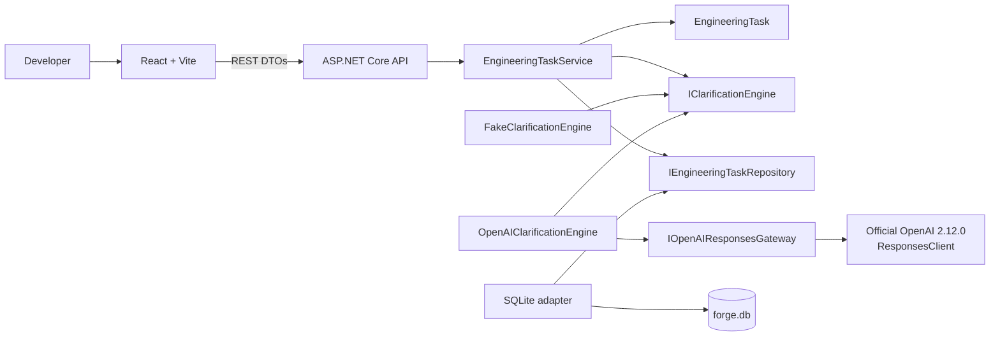
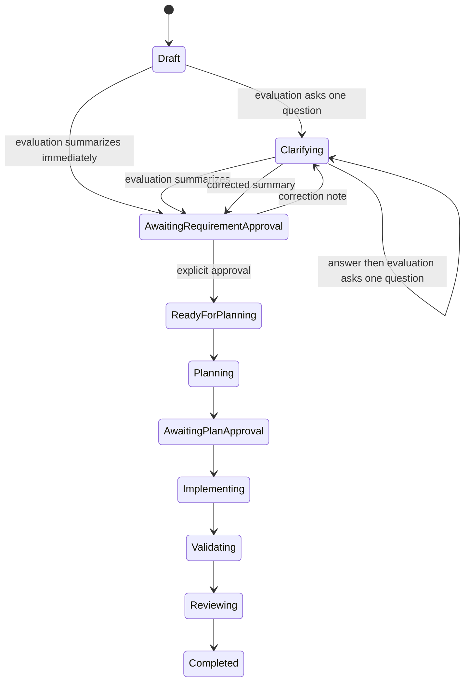
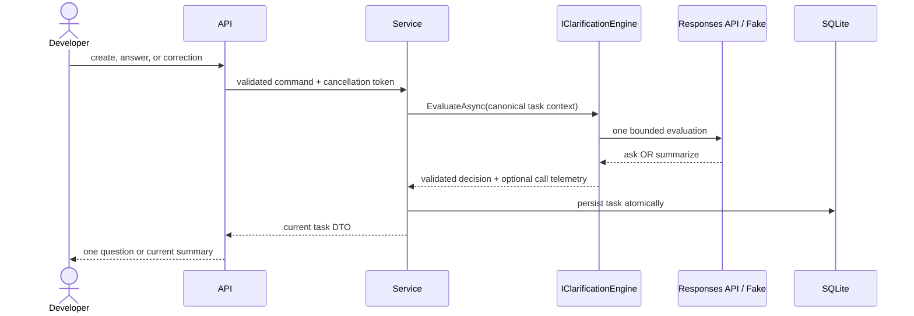

# Architecture

## Components and dependency direction

- **Forge.Core** owns the `EngineeringTask` aggregate, purpose-specific workflow operations, async clarification contract, correction notes, model-call records, and application service. It has no project dependencies.
- **Forge.Infrastructure** implements Core ports with SQLite, deterministic Fake clarification, configurable pricing, and an OpenAI clarification adapter.
- **Forge.Api** selects Fake or OpenAI mode, exposes REST DTOs and safe capabilities, and maps exceptions to RFC-compatible Problem Details.
- **forge-web** renders one current action, correction/revision history, capabilities, and live task telemetry through REST.

Dependencies point inward: API and Infrastructure depend on Core; Core knows neither. Official SDK types remain inside `SdkOpenAIResponsesGateway`. The `IOpenAIResponsesGateway` normalization boundary permits non-billable adapter tests.

## Clarification state and correction flow

The aggregate has no public general-purpose state transition. Application callers use explicit operations to apply an evaluation, answer the current question, request a summary revision, record a model call, or approve a summary.

Correction is permitted only while awaiting requirement approval. The correction record retains its timestamp and previous summary; previous clarification answers remain unchanged. The current summary is cleared before reevaluation and the revised summary requires another explicit approval.

## OpenAI structured-output boundary

OpenAI mode uses `gpt-5.6-terra`, low reasoning effort, and a bounded 800-token output through the Responses API. `CreateResponseOptions.TextOptions` specifies `ResponseTextFormat.CreateJsonSchemaFormat(..., jsonSchemaIsStrict: true)`. The schema contains:

- `decision`: `ask` or `summarize`;
- nullable `question` and `summary`;
- arrays for known facts, assumptions, and unresolved gaps.

After deserialization the adapter independently enforces:

- ask: one non-empty question and no summary;
- summarize: one non-empty summary and no question.

Malformed, both, neither, and unknown decisions are provider failures. Forge never free-form parses or silently invokes Fake mode.

The developer instruction prefix is stable. Each turn reconstructs one compact JSON context containing only the repository identifier, original requirement, previous question/answer pairs, and correction notes. Repository content is never implied. `previous_response_id` is intentionally unused.

## Telemetry and estimated cost

Each real provider attempt records call ID, clarification stage, provider, model, reasoning effort, timestamps, success, response ID, input/cached/output/reasoning tokens, estimated cost, and a non-sensitive failure category. Fake mode produces no model-call record.

The estimate subtracts cached tokens from total input, prices uncached and cached input separately, then adds output pricing. Output already contains reasoning tokens, so reasoning usage is not double-counted. Rates are bound from `Forge:AI:Pricing`.

## Persistence compatibility

`EngineeringTasks` retains the first-slice columns and adds:

- `RequirementRevisionNotes TEXT NOT NULL DEFAULT '[]'`
- `ModelCalls TEXT NOT NULL DEFAULT '[]'`

Development startup uses `PRAGMA table_info(EngineeringTasks)` and adds only missing known columns. Existing databases do not need to be deleted.

## Failure handling and capabilities

Central exception handling maps missing tasks, invalid workflow operations, configuration faults, provider faults, and unexpected failures to safe Problem Details. Provider exception bodies and logs never include credentials or raw responses.

`GET /api/system/capabilities` returns mode, model, reasoning effort, safe configuration readiness, and truthful `false` values for repository inspection and planning. It exposes no key or secret-derived data.

## Current boundaries

Repository scanning, planning, target-repository changes/tests, review, repair, pull-request creation, authentication, production migrations, and live provider validation are not part of this slice.
