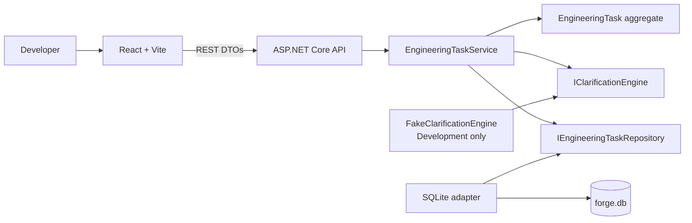
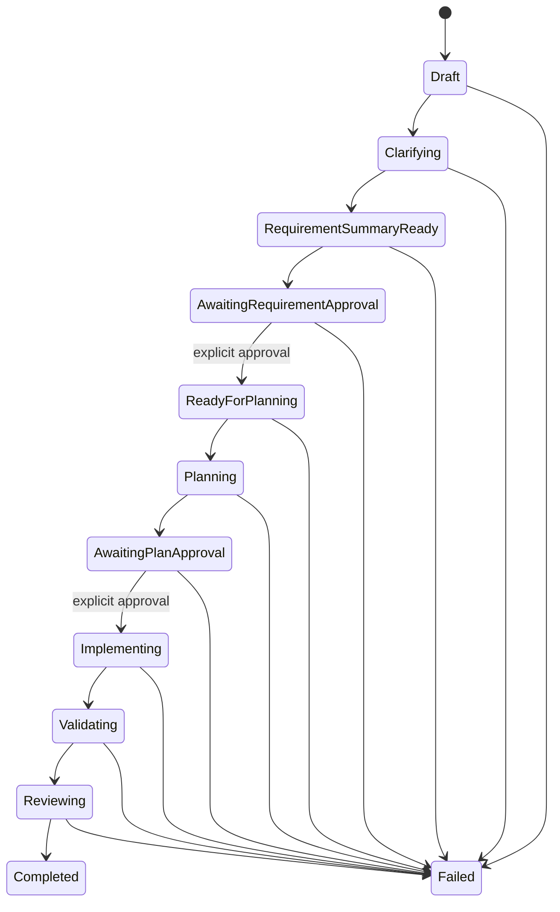
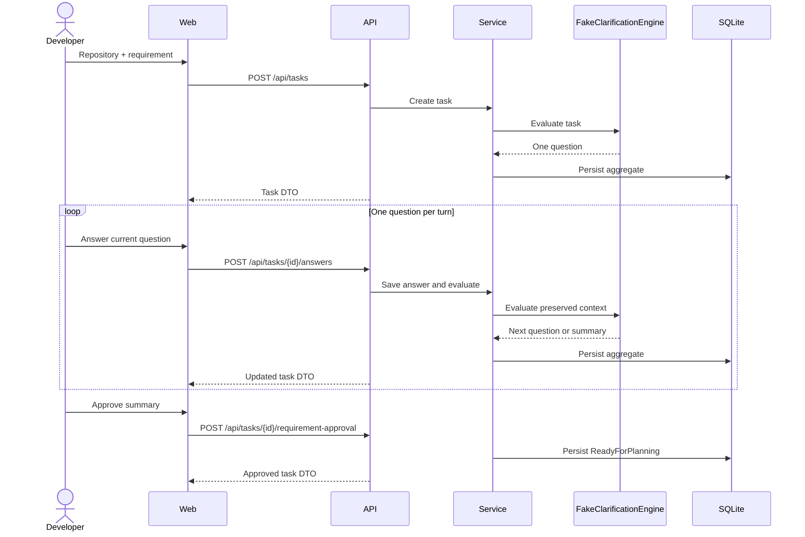

# Architecture

## Components and responsibilities

- **Forge.Core** contains the `EngineeringTask` aggregate, workflow state machine, clarification contracts, repository port, and application service. It has no project dependencies.
- **Forge.Infrastructure** contains the development-only `FakeClarificationEngine`, SQLite repository, and development database bootstrap.
- **Forge.Api** composes the application and exposes REST DTOs for creating, reading, answering, and approving tasks. Swagger is enabled in Development.
- **forge-web** is a React client that renders the current state and communicates only through REST.

Dependency direction is `Web → HTTP API → Core ports ← Infrastructure adapters`. Core never references Infrastructure or API.

## Workflow state machine

Invalid state changes throw `WorkflowException` in domain code. The current slice ends at `ReadyForPlanning`; later states exist so their order is explicit, not to imply their functionality is present.

## Current clarification sequence

## Integration boundaries

`IClarificationEngine` is the replacement point for a future OpenAI adapter. That adapter will return one prioritized question or a grounded summary, plus recorded model-call metadata; it must not bypass domain gates.

Repository discovery, relevant-file retrieval, deterministic search, builds, tests, and diff inspection will be introduced behind focused tool interfaces. Planning must cite retrieved files and evidence. Target-repository mutation remains prohibited until both requirement and plan approval are stored.
