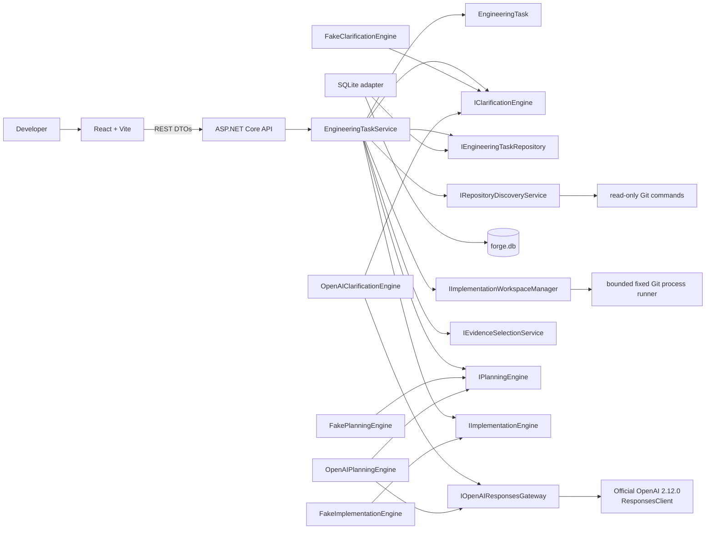
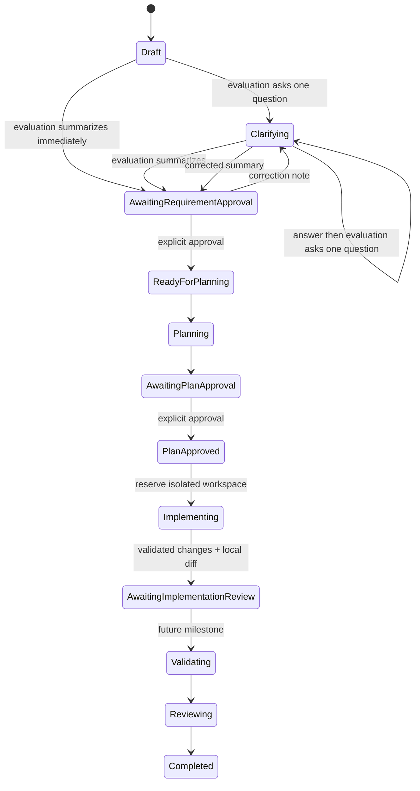
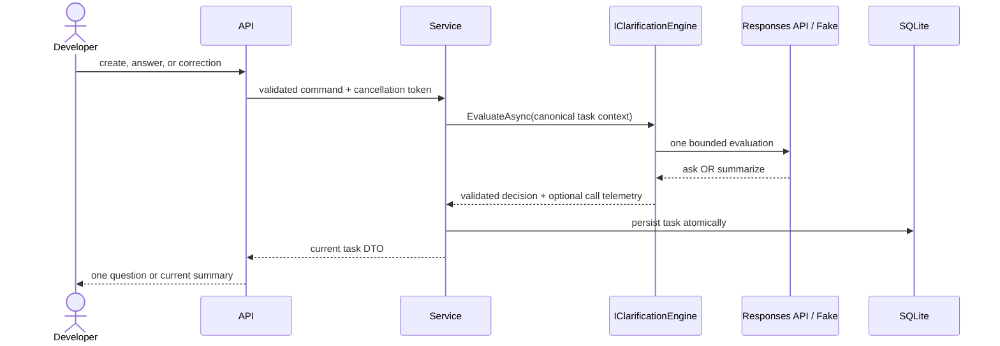

# Architecture

## Components and dependency direction

- **Forge.Core** owns the aggregate, approval gates, repository/evidence/plan contracts, workflow invariants, and application service. It has no project dependencies.
- **Forge.Infrastructure** implements SQLite, clarification/planning adapters, safe repository discovery, and isolated Git worktree/Fake implementation adapters.
- **Forge.Api** composes modes and workflow services, exposes REST DTOs and safe capabilities, and maps exceptions to Problem Details.
- **forge-web** renders clarification, evidence, plans, approvals, bounded implementation diffs, capabilities, and telemetry through REST.

Dependencies point inward: API and Infrastructure depend on Core; Core knows neither. Official SDK types remain inside `SdkOpenAIResponsesGateway`. The `IOpenAIResponsesGateway` normalization boundary permits non-billable adapter tests.

## Clarification state and correction flow

The aggregate has no public general-purpose state transition. Application callers use explicit operations to apply an evaluation, answer the current question, request a summary revision, record a model call, or approve a summary.

Correction is permitted only while awaiting requirement approval. The correction record retains its timestamp and previous summary; previous clarification answers remain unchanged. The current summary is cleared before reevaluation and the revised summary requires another explicit approval.

## Read-only repository analysis and planning

After requirement approval, purpose-specific aggregate operations begin analysis, store a compact snapshot, store bounded evidence, store a validated plan, and approve that plan. Re-analysis is allowed before plan approval and replaces the prior snapshot/evidence/plan. Planning rejects missing evidence, stale snapshots, fingerprint mismatches, unsafe paths, unknown evidence IDs, and invalid create/modify/delete targets.

Discovery normalizes the root, contains every inspected path, skips reparse points, and uses `ProcessStartInfo.ArgumentList` for read-only Git commands. It never invokes repository scripts. Common dependency/build folders, generated/minified/binary files, and likely secret files are excluded. Configurable defaults cap discovery at 5,000 files, text at 256 KB per file and 20 MB total, and evidence at 12 files/60,000 characters. Limit warnings make partial inspection visible.

Evidence selection deterministically scores strong phrases, paths, lightweight C#/TypeScript symbols, content, roles, related tests/contracts, and module diversity. Generic documentation and unrelated clarification code receive penalties. Excerpts retain line numbers, are de-duplicated, hashed, and redact obvious sensitive key/value lines before persistence. Redaction is not a comprehensive secret scanner.

`FakePlanningEngine` creates a labelled plan without a model call. `OpenAIPlanningEngine` makes exactly one Responses request using `gpt-5.6-sol`, medium reasoning, a 6,000-token allowance, and strict schema. Plans are capped at ten affected files, eight steps, and eight validation commands, plus four risks, assumptions, and unresolved questions. Both planners produce structured affected files, sequential steps, and up to twelve compact requirement-coverage mappings. Existing paths must cite evidence from that path, creates must be absent from the snapshot, validation commands remain proposals, and absolute/traversal paths are rejected. Evidence selection and mutation scope are deliberately separate: unrelated evidence may remain read-only context, while narrowly recognized approved or latest-correction `only` lists constrain the affected paths. Explicit exclusions, exact action counts, test prohibitions, and validation-command prohibitions are represented deterministically. A Core trust gate checks every Fake or OpenAI candidate against those constraints before persistence, and a structurally requested revision that changes only wording fails safely. Plan approval moves the workflow to `PlanApproved` and is the only initial implementation gate.

## Isolated implementation boundary

The initial implementation boundary is deterministic Fake mode only. `IImplementationEngine` returns bounded structured create/modify/delete operations, never commands or patches. Before any lease, task state transition, ownership ref, branch, or worktree, a read-only reservation preflight returns the exact bounded file contexts, the Fake engine generates the exact output once, and the domain validator checks exact one-to-one coverage, actions, original hashes, undeclared/duplicate paths, create/modify/delete content, no-op rules, sensitive content, and transformed per-file/total limits. That validated output is reused rather than regenerated. Inspect-only plan paths may be context but cannot become operations.

`IImplementationWorkspaceManager` revalidates a clean exact Git root and approved HEAD, captures active HEAD/branch/index/status plus bounded hashes of all tracked regular working-tree bytes, then byte-for-byte compares paths, actions, source hashes, and source content with the preflight both before owned Git artifacts and after sparse materialization. It creates a deterministic task branch and linked sparse worktree outside the repository, disables hooks/submodules/fsmonitor/external diff/LFS smudge, rejects executable filters, symlinks/gitlinks/reparse points, malformed/truncated/abnormal/sparse index states, and materializes only approved paths. All source content dependencies and filesystem targets are contained, size-bounded, and secret-scanned before reservation or the first atomic write. Local fixed-argument Git diff supplies complete hashes/counts and bounded previews with explicit truncation; result/operation free text, safe failures, source/generated content, and diffs share the high-confidence detector with credential-labelled entropy detection. No repository command, build, test, lint, stage, commit, push, or provider request occurs.

Workspace identity is persisted without exposing its absolute path through DTOs. Core supplies one stable `Repository <16 hex>` identifier used by API history/detail and Fake clarification, preventing indirect path disclosure through task and plan PDFs. A reserved untouched workspace may be reconstructed and resumed after restart. Completed results include a deterministic manifest fingerprint binding every per-file review field, preview hash, result total, completion/certainty field, and actual final-file hash/line/byte and worktree totals. It is verified under the operating-system lock immediately before and after persistence and during later availability checks. A missing, changed, or metadata-inconsistent workspace leaves the historical bounded diff readable but changes runtime disposition to `RecoveryRequired`; it is never automatically reset or deleted. Concurrent implementation commands are serialized in-process and protected across processes by row-version compare-and-swap updates, a fixed-duration persisted owner/attempt lease, and an exclusive operating-system workspace lock. An exhaustive status/phase/lease/failure/timestamp matrix governs every durable projection and preserves an explicit legacy path. One SQLite statement returns implementation JSON and its character/blob-byte lengths from one snapshot, validates all lengths before `GetString`, and never writes during GET; provider failures are normalized without exposing storage details.

All Git invocations share a startup-resolved absolute executable and one hardened execution envelope. The child environment is rebuilt from a small allowlist; Git directory/worktree/index/object/config/attribute overrides are not inherited; prompts, credentials, pagers, external diff, textconv, fsmonitor, hooks, submodule recursion, optional locks, LFS smudging, and automatic maintenance are disabled or contained. Correctness-bearing truncated output is rejected rather than interpreted as complete.

Writable files are currently limited to strict UTF-8 without a BOM. Snapshot metadata carries BOM/strict-UTF-8 eligibility and plan validation rejects an ineligible mutating path before approval. This slice does not claim general encoding preservation.

## OpenAI structured-output boundaries

Clarification uses `gpt-5.6-terra`, low reasoning effort, and a bounded 800-token output. Planning uses `gpt-5.6-sol`, medium reasoning effort, and a bounded 6,000-token allowance covering visible and reasoning tokens. Both use the Responses API with `ResponseTextFormat.CreateJsonSchemaFormat(..., jsonSchemaIsStrict: true)`. The clarification schema contains:

- `decision`: `ask` or `summarize`;
- nullable `question`, internal `questionFocus`, and `summary`;
- arrays for known facts, assumptions, and unresolved gaps.

After deserialization the adapter independently enforces:

- ask: one concise question for one atomic decision dimension, one snake-case focus, and no summary;
- summarize: one non-empty summary and null question/focus.

Questions with multiple marks, newlines, list syntax, excessive length, or a structurally combined focus are invalid provider responses. Semantic atomicity remains primarily prompt- and focus-driven. Forge never repairs output, makes a second model call, free-form parses, or silently invokes Fake mode.

The planning schema requires title, objective, repository understanding, affected files, ordered structured steps, proposed validation commands, risks, assumptions, unresolved questions, requirement coverage, and summary. Coverage items map concise material requirements to declared affected paths and existing step orders; local validation checks those references without claiming semantic completeness. Planning instructions distinguish implementing tests from merely executing validation commands, require a concrete artifact generator and endpoint integration for generated exports, and direct the planner toward evidence-backed API helpers, service boundaries, dependency registration, project/package files, and test projects. Supported `maxItems` constraints reinforce collection caps, which are independently enforced after deserialization. Source, model, timestamp, and repository fingerprint are enriched internally. Canonical context contains requirement context, the bounded derived explicit-constraint representation, repository totals/stack/project/test metadata, warnings, and selected evidence only; it excludes the normalized root, the complete repository file list, full file contents, raw responses, credentials, and hidden reasoning. The latest correction replaces an earlier authoritative allowlist only when it supplies a new explicit list; otherwise its explicit exclusions and policy restrictions narrow the approved constraints.

The normalized gateway preserves `ResponseResult.Status` and `IncompleteStatusDetails.Reason`. Planning deserializes only `Completed` output. `Incomplete` with `MaxOutputTokens` becomes `output_truncated`; `ContentFilter` becomes `content_filter`. Both preserve response ID, usage, and estimated cost while discarding partial text. There is no automatic retry; the UI offers an explicit one-call retry using the persisted fresh snapshot and evidence, and switches to explicit re-analysis only when the API reports a stale snapshot.

The developer instruction prefix is stable. Each turn reconstructs one compact JSON context containing only the repository identifier, original requirement, previous question/answer pairs, and correction notes. Repository content is never implied. `previous_response_id` is intentionally unused.

## Telemetry and estimated cost

Each real provider attempt records call ID, clarification, planning, or future implementation stage, provider, model, reasoning effort, timestamps, success, response ID, input/cached/output/reasoning tokens, estimated cost, and a non-sensitive failure category. Failed planning attempts are persisted before their safe error is returned. Fake mode produces no model-call record.

The estimate subtracts cached tokens from total input, prices uncached and cached input separately, then adds output pricing. Output already contains reasoning tokens, so reasoning usage is not double-counted. Rates are bound from `Forge:AI:Pricing`.

## Persistence compatibility

`EngineeringTasks` retains the first-slice columns and adds:

- `RequirementRevisionNotes TEXT NOT NULL DEFAULT '[]'`
- `ModelCalls TEXT NOT NULL DEFAULT '[]'`
- bounded snapshot, evidence, and implementation-plan JSON columns;
- bounded implementation workspace, result, safe failure, and lease JSON columns plus start/completion timestamps and an optimistic row version;
- evidence counters, repository analysis/fingerprint fields, and plan creation/approval timestamps.

Development startup uses `PRAGMA table_info(EngineeringTasks)` and adds only missing known columns. Existing databases do not need to be deleted.

## Failure handling and capabilities

Central exception handling maps missing tasks, invalid workflow operations, configuration faults, provider faults, and unexpected failures to safe Problem Details. Provider exception bodies and logs never include credentials or raw responses.

`GET /api/system/capabilities` reports clarification, planning, and implementation readiness independently. Fake mode reports isolated target modification and human diff review available; validation and pull-request creation remain false. OpenAI implementation remains unavailable even when clarification/planning are configured. No capability exposes a key, absolute workspace, or secret-derived data.

## Current boundaries

Semantic AI implementation, implementation correction/rejection, worktree cleanup or quota management, validation execution, commit/push, pull-request creation, authentication, production migrations, and provider retry policy are not part of this slice.
