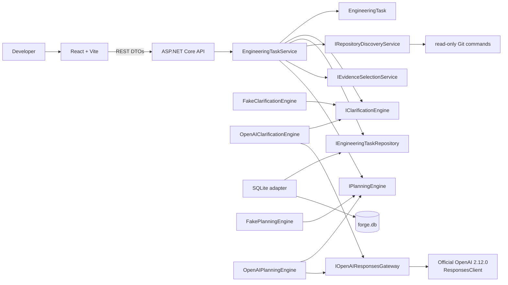
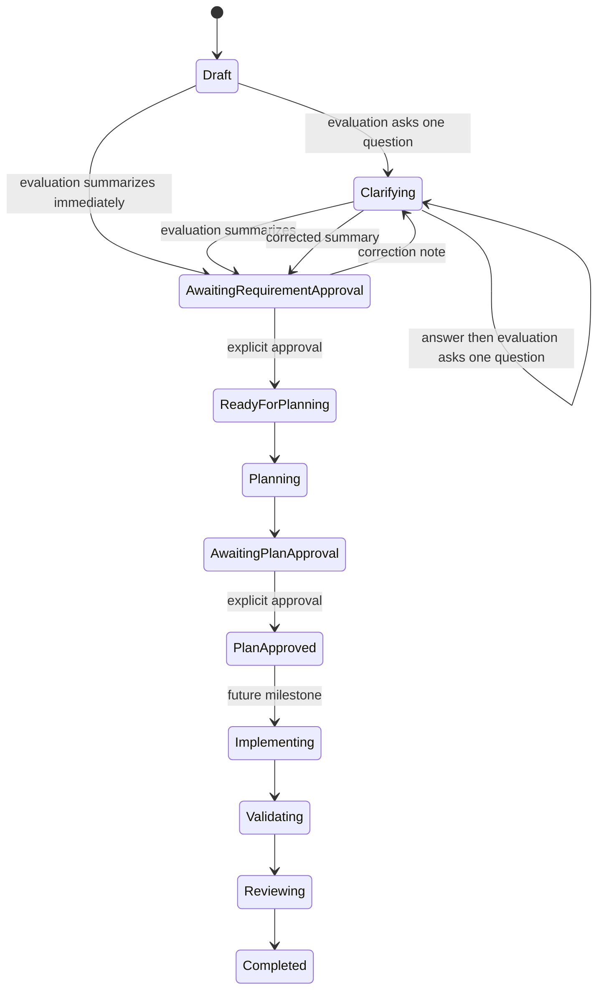
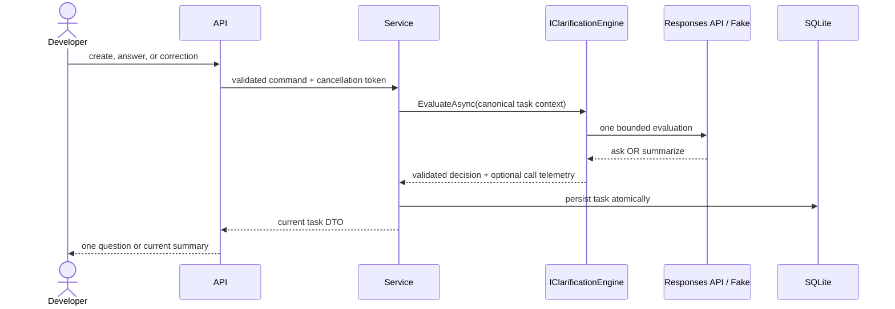

# Architecture

## Components and dependency direction

- **Forge.Core** owns the aggregate, approval gates, repository/evidence/plan contracts, workflow invariants, and application service. It has no project dependencies.
- **Forge.Infrastructure** implements SQLite, clarification adapters, safe repository discovery, deterministic evidence ranking, and Fake planning.
- **Forge.Api** composes modes and read-only planning services, exposes REST DTOs and safe capabilities, and maps exceptions to Problem Details.
- **forge-web** renders clarification, repository snapshots, evidence, plans, approvals, capabilities, and telemetry through REST.

Dependencies point inward: API and Infrastructure depend on Core; Core knows neither. Official SDK types remain inside `SdkOpenAIResponsesGateway`. The `IOpenAIResponsesGateway` normalization boundary permits non-billable adapter tests.

## Clarification state and correction flow

The aggregate has no public general-purpose state transition. Application callers use explicit operations to apply an evaluation, answer the current question, request a summary revision, record a model call, or approve a summary.

Correction is permitted only while awaiting requirement approval. The correction record retains its timestamp and previous summary; previous clarification answers remain unchanged. The current summary is cleared before reevaluation and the revised summary requires another explicit approval.

## Read-only repository analysis and planning

After requirement approval, purpose-specific aggregate operations begin analysis, store a compact snapshot, store bounded evidence, store a validated plan, and approve that plan. Re-analysis is allowed before plan approval and replaces the prior snapshot/evidence/plan. Planning rejects missing evidence, stale snapshots, fingerprint mismatches, unsafe paths, unknown evidence IDs, and invalid create/modify/delete targets.

Discovery normalizes the root, contains every inspected path, skips reparse points, and uses `ProcessStartInfo.ArgumentList` for read-only Git commands. It never invokes repository scripts. Common dependency/build folders, generated/minified/binary files, and likely secret files are excluded. Configurable defaults cap discovery at 5,000 files, text at 256 KB per file and 20 MB total, and evidence at 12 files/60,000 characters. Limit warnings make partial inspection visible.

Evidence selection deterministically scores strong phrases, paths, lightweight C#/TypeScript symbols, content, roles, related tests/contracts, and module diversity. Generic documentation and unrelated clarification code receive penalties. Excerpts retain line numbers, are de-duplicated, hashed, and redact obvious sensitive key/value lines before persistence. Redaction is not a comprehensive secret scanner.

`FakePlanningEngine` creates a labelled plan without a model call. `OpenAIPlanningEngine` makes exactly one Responses request using `gpt-5.6-sol`, medium reasoning, a 6,000-token allowance, and strict schema. Plans are capped at six affected files, steps, and validation commands, plus four risks, assumptions, and unresolved questions. Both planners produce structured affected files and sequential steps. Existing paths must cite evidence from that path, creates must be absent from the snapshot, validation commands remain proposals, and absolute/traversal paths are rejected. Plan approval moves the workflow to `PlanApproved`; implementation is a future milestone.

## OpenAI structured-output boundaries

Clarification uses `gpt-5.6-terra`, low reasoning effort, and a bounded 800-token output. Planning uses `gpt-5.6-sol`, medium reasoning effort, and a bounded 6,000-token allowance covering visible and reasoning tokens. Both use the Responses API with `ResponseTextFormat.CreateJsonSchemaFormat(..., jsonSchemaIsStrict: true)`. The clarification schema contains:

- `decision`: `ask` or `summarize`;
- nullable `question`, internal `questionFocus`, and `summary`;
- arrays for known facts, assumptions, and unresolved gaps.

After deserialization the adapter independently enforces:

- ask: one concise question for one atomic decision dimension, one snake-case focus, and no summary;
- summarize: one non-empty summary and null question/focus.

Questions with multiple marks, newlines, list syntax, excessive length, or a structurally combined focus are invalid provider responses. Semantic atomicity remains primarily prompt- and focus-driven. Forge never repairs output, makes a second model call, free-form parses, or silently invokes Fake mode.

The planning schema requires title, objective, repository understanding, affected files, ordered structured steps, proposed validation commands, risks, assumptions, unresolved questions, and summary. Supported `maxItems` constraints reinforce collection caps, which are independently enforced after deserialization. Source, model, timestamp, and repository fingerprint are enriched internally. Canonical context contains requirement context, repository totals/stack/project/test metadata, warnings, and selected evidence only; it excludes the normalized root, the complete repository file list, full file contents, raw responses, credentials, and hidden reasoning.

The normalized gateway preserves `ResponseResult.Status` and `IncompleteStatusDetails.Reason`. Planning deserializes only `Completed` output. `Incomplete` with `MaxOutputTokens` becomes `output_truncated`; `ContentFilter` becomes `content_filter`. Both preserve response ID, usage, and estimated cost while discarding partial text. There is no automatic retry; the UI offers an explicit one-call retry using the persisted fresh snapshot and evidence, and switches to explicit re-analysis only when the API reports a stale snapshot.

The developer instruction prefix is stable. Each turn reconstructs one compact JSON context containing only the repository identifier, original requirement, previous question/answer pairs, and correction notes. Repository content is never implied. `previous_response_id` is intentionally unused.

## Telemetry and estimated cost

Each real provider attempt records call ID, clarification or planning stage, provider, model, reasoning effort, timestamps, success, response ID, input/cached/output/reasoning tokens, estimated cost, and a non-sensitive failure category. Failed planning attempts are persisted before their safe error is returned. Fake mode produces no model-call record.

The estimate subtracts cached tokens from total input, prices uncached and cached input separately, then adds output pricing. Output already contains reasoning tokens, so reasoning usage is not double-counted. Rates are bound from `Forge:AI:Pricing`.

## Persistence compatibility

`EngineeringTasks` retains the first-slice columns and adds:

- `RequirementRevisionNotes TEXT NOT NULL DEFAULT '[]'`
- `ModelCalls TEXT NOT NULL DEFAULT '[]'`
- bounded snapshot, evidence, and implementation-plan JSON columns;
- evidence counters, repository analysis/fingerprint fields, and plan creation/approval timestamps.

Development startup uses `PRAGMA table_info(EngineeringTasks)` and adds only missing known columns. Existing databases do not need to be deleted.

## Failure handling and capabilities

Central exception handling maps missing tasks, invalid workflow operations, configuration faults, provider faults, and unexpected failures to safe Problem Details. Provider exception bodies and logs never include credentials or raw responses.

`GET /api/system/capabilities` reports clarification and planning provider/model/readiness independently, while target modification, validation, review, and pull-request creation remain false. OpenAI mode starts without a key and reports both AI stages unavailable. It exposes no key or secret-derived data.

## Current boundaries

Target-repository changes/tests, review, repair, pull-request creation, authentication, production migrations, and provider retry policy are not part of this slice.
